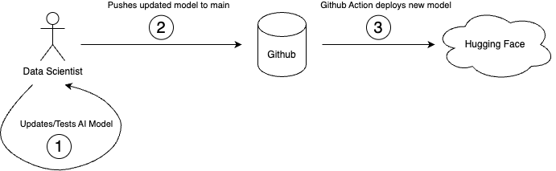

# Hugging Face CI Demo

A simple demonstration to showcase how to automate the deployment of an AI application to a live production environment.

The AI application is a simple text summarizer: given a corpus of text, the model generates a paragraph summarizing the content.

The app uses the Gradio framework to present a web interface to the user in order to collect the input text. 

The webapp wrapping the model is automatically deployed to the Hugging Face platform using Github actions: whenever code changes are pushed to the main branch, a workflow is triggered to sync the changes:

To try out the live (deployed) model, visit the [CI Demo App running on Hugging Face](https://huggingface.co/spaces/javsand/ci-demo)